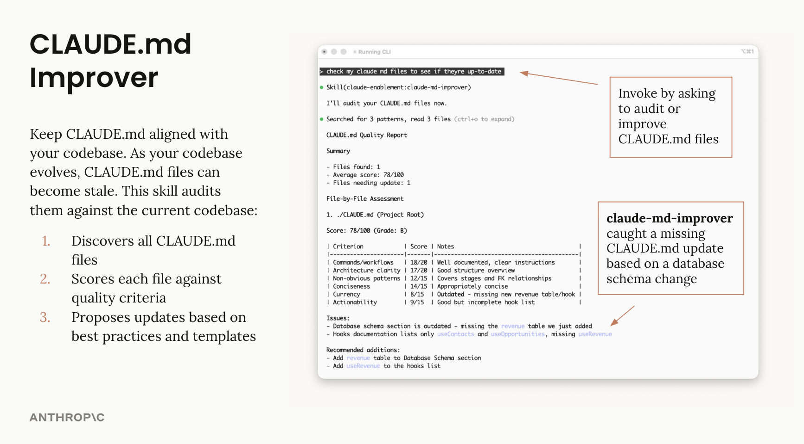
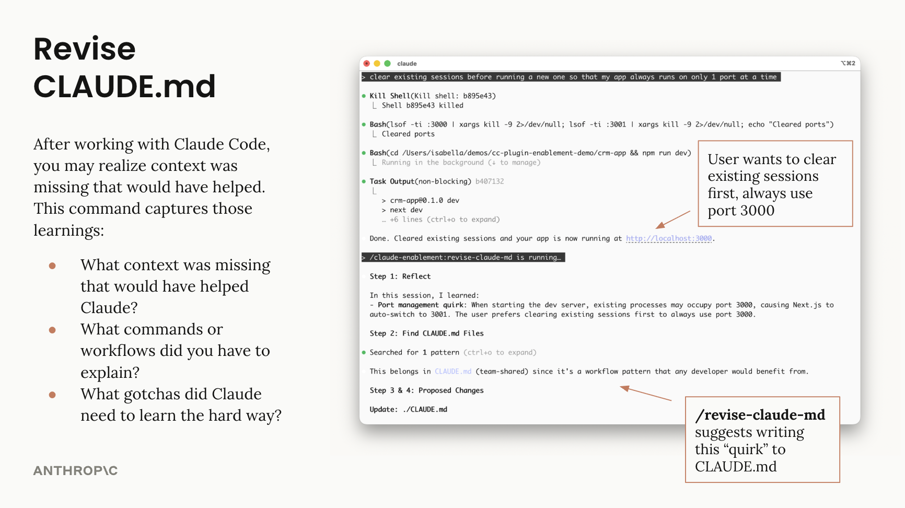

# claudemd-curator

Curate project-memory artifacts across a workspace: `CLAUDE.md`, `AGENTS.md`,
`.claude/rules/*.md`, and `MEMORY.md`. Audit quality against a six-criterion
rubric, capture end-of-session learnings, keep memory current.

## What it does

| Surface | Purpose | Trigger |
|---|---|---|
| `claudemd-curator` (skill) | Audit + improve memory artifacts against codebase state | Periodic maintenance, or user asks "audit my CLAUDE.md / AGENTS.md" |
| `/revise-claudemd` (command) | Capture learnings from the current session into the right file | End of session |

Recognised artifacts (in discovery order):

| Path | Type |
|---|---|
| `./CLAUDE.md` | Project memory (team-shared, git-tracked) |
| `./AGENTS.md` | Project memory (Codex / OpenAI / Codeium standard; treated as a peer of CLAUDE.md) |
| `./.claude.local.md` | Personal overrides (gitignored) |
| `./.claude/rules/*.md` | Auto-loaded rule files (Claude Code reads everything in this dir) |
| `~/.claude/CLAUDE.md` | User-wide global defaults |
| `./packages/*/CLAUDE.md` | Per-package memory in monorepos |
| `~/.claude/projects/*/memory/MEMORY.md` | Auto-memory index (read-only awareness; do not rewrite) |

## Usage

### Audit

```text
"audit my CLAUDE.md and AGENTS.md"
"check whether memory files are up to date in this repo"
```

The skill discovers all known artifacts, scores each against the rubric
(commands, architecture, gotchas, conciseness, currency, actionability),
prints a report, and waits for approval before writing anything.



### End-of-session capture

```text
/revise-claudemd
```

Reflects on what the session revealed, drafts targeted additions, asks where
each one belongs (`CLAUDE.md` vs `AGENTS.md` vs `.claude.local.md`), shows
diffs, and applies only what you approve.



## Attribution

Forked from [`anthropics/claude-plugins-official` `claude-md-management`](https://github.com/anthropics/claude-plugins-official) (author: Isabella He, `isabella@anthropic.com`).
Original `LICENSE` retained inside this plugin directory.

Modifications in this fork:

- AGENTS.md is a first-class peer of CLAUDE.md (not ignored).
- `.claude/rules/*.md` is recognised as auto-loaded memory.
- MEMORY.md (auto-memory index) is recognised but not rewritten.
- Plugin and skill renamed to match the marketplace's verb-flavoured stack tone.

Phase 2 work (cross-plugin integration with `marketplace-tour` capability
snapshot, plugin-aware audit mode, workspace-wide multi-repo scan) is tracked
in [`AGENTS.md`](../../AGENTS.md) under "Next session — start here".
